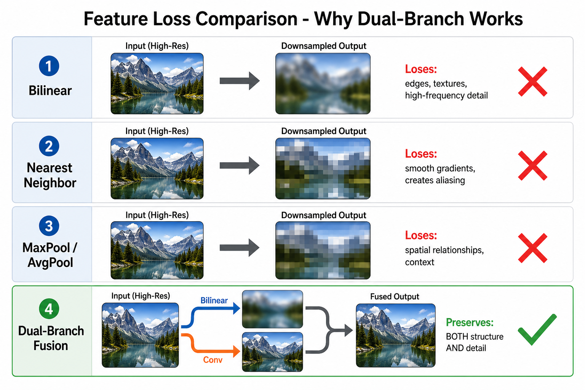
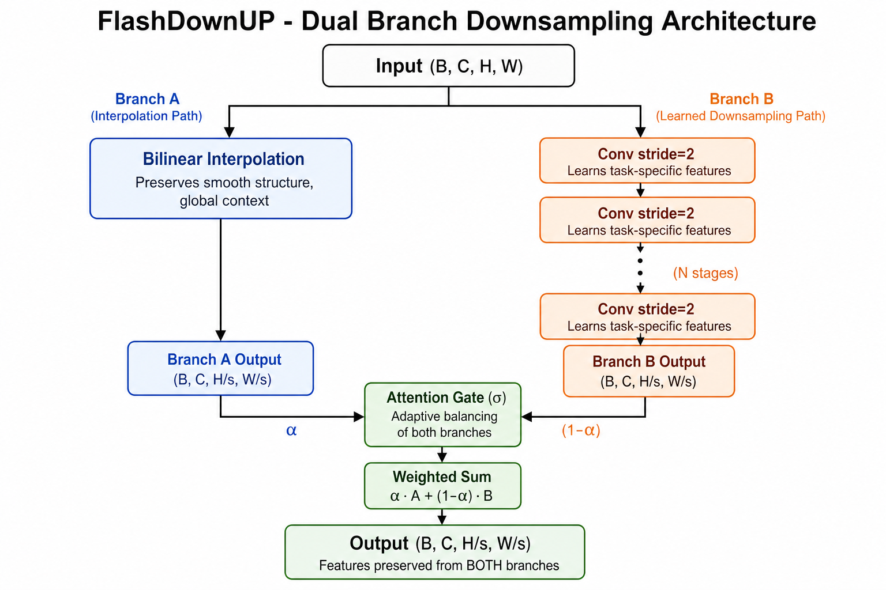
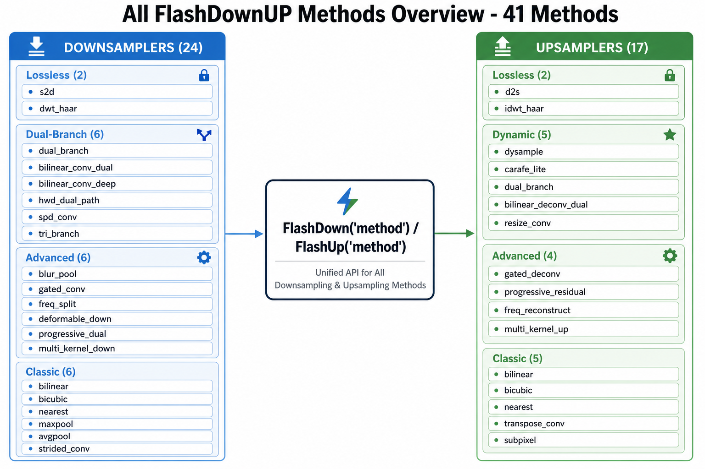
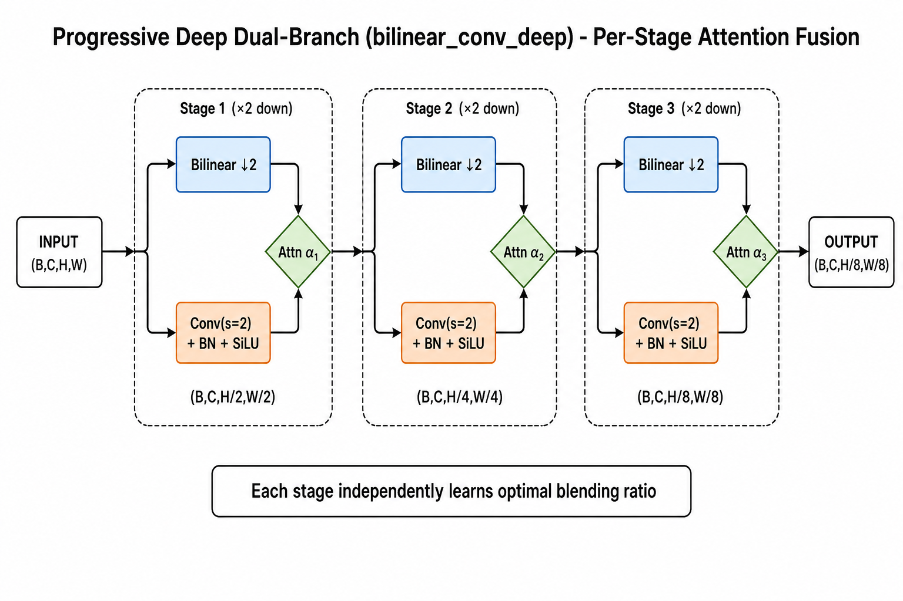
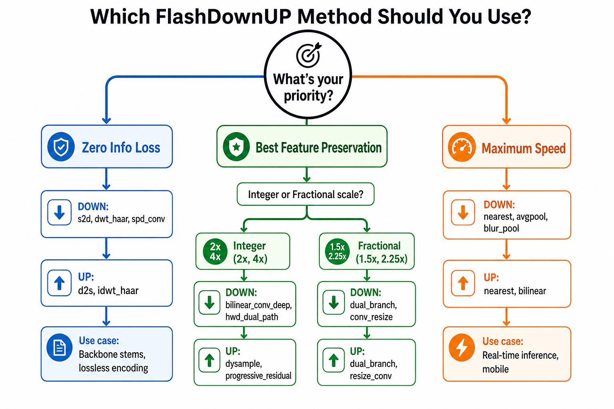

# FlashDownUP

**Feature-Preserving Downsampling & Upsampling for PyTorch**

Part of the [FlashVision](https://github.com/FlashVision) ecosystem.

---

## The Problem

Every time you downsample a feature map, you lose information. Bilinear smooths your edges away. Nearest neighbor creates ugly aliasing. MaxPool throws away spatial context. There's no free lunch with any single method.



## Our Approach

What if you run **two methods in parallel** and let the network learn which one to trust at each pixel?

That's exactly what FlashDownUP does. We take bilinear (which keeps smooth structure) and strided convolutions (which learn task-specific features), run them side-by-side, and fuse them with an attention gate. The gate learns: "use bilinear in smooth regions, use conv in edge/texture regions."

The result — features survive the downsampling. Nothing important gets lost.



---

## Getting Started

```bash
pip install -e .
```

```python
import torch
from flashdownup import FlashDown, FlashUp

x = torch.randn(1, 64, 256, 256)

# Dual-branch downsample: bilinear + conv with attention gate
down = FlashDown("bilinear_conv_dual", in_channels=64, num_stages=2)
y = down(x)  # (1, 64, 64, 64) — 4x down, features preserved

# Progressive residual upsample: bilinear base + learned detail
up = FlashUp("progressive_residual", in_channels=64, num_stages=2)
recon = up(y)  # (1, 64, 256, 256)

# Or go fully lossless — zero information lost, guaranteed
down = FlashDown("s2d", scale=2)
up = FlashUp("d2s", scale=2)
assert torch.allclose(x, up(down(x)))  # bit-perfect reconstruction
```

---

## What's Inside



We've implemented 41 methods total. Here's what matters:

### If you want zero information loss

Use `s2d` (Space-to-Depth) or `dwt_haar` (Haar wavelet). They rearrange spatial info into channels — nothing gets discarded. Perfect for backbone stems where you can't afford to lose small objects.

```python
down = FlashDown("s2d", scale=2)        # (B,C,H,W) → (B, C×4, H/2, W/2)
down = FlashDown("spd_conv", in_channels=64, scale=2)  # same idea + learned fusion
```

### If you want best feature preservation (our dual-branch methods)

These are the core of this library. Two branches, one attention gate, minimal loss:

```python
# Basic: bilinear + nearest, learned 1x1 conv merge
down = FlashDown("dual_branch", in_channels=64, scale_factor=2.0)

# Better: bilinear + stacked strided convs, attention gate
down = FlashDown("bilinear_conv_dual", in_channels=64, num_stages=2)

# Best: per-stage attention at every resolution level
down = FlashDown("bilinear_conv_deep", in_channels=64, num_stages=3)
```

For upsampling, DySample (ICCV 2023) is incredible — only 136 parameters and beats everything:

```python
up = FlashUp("dysample", in_channels=64, scale=2)  # 136 params, SOTA quality
```

### If you want fractional scales (like 1080p → 720p)

Most methods only support integer 2x, 4x. Our dual-branch methods handle any ratio:

```python
# 1080p → 720p (1.5x reduction)
down = FlashDown("dual_branch", in_channels=3, scale_factor=1.5)

# 720p → 1080p
up = FlashUp("dual_branch", in_channels=3, scale_factor=1.5)
```

### If you want maximum speed

Zero-parameter methods for real-time inference:

```python
down = FlashDown("nearest", scale=2)   # fastest, no params
down = FlashDown("blur_pool", in_channels=64, stride=2)  # fast + anti-aliased
```

---

## How the Deep Dual-Branch Works

For multi-stage downsampling (4x, 8x, 16x), the `bilinear_conv_deep` method applies attention fusion at **every stage independently**:



Each stage has its own attention gate. Early stages (where high-freq info is still present) may favor the conv branch. Later stages (where only coarse structure remains) may favor bilinear. The network figures this out during training.

---

## Picking the Right Method



Here's the practical guide:

| You're building... | Use for downsampling | Use for upsampling |
|---|---|---|
| Detection backbone (YOLO, DETR) | `spd_conv` or `bilinear_conv_dual` | — |
| Feature pyramid (FPN) | `bilinear_conv_dual` | `dysample` |
| U-Net / segmentation decoder | `bilinear_conv_deep` | `progressive_residual` |
| Super-resolution model | — | `dysample` or `freq_reconstruct` |
| GAN / generative model | `gated_conv` | `gated_deconv` |
| Video streaming (fractional resize) | `dual_branch` or `conv_resize` | `dual_branch` |
| Mobile / real-time | `blur_pool` or `nearest` | `nearest` or `bilinear` |
| Small object detection | `freq_split` or `hwd_dual_path` | — |

---

## The Progressive Residual Trick

Training a dual-branch from scratch can be tricky — the conv branch outputs random values early on. Our `progressive_dual` and `progressive_residual` methods solve this elegantly:

```
output = bilinear + tanh(α) × conv_residual
```

At initialization, `α = 0`, so the output is **pure bilinear** (always reasonable). As training progresses, `α` grows and the network gradually adds learned corrections. This gives you stable training from epoch 0 without any warmup tricks.

---

## Benchmarks

Measured on CPU, input `(1, 64, 128, 128)`, 2x downsample:

| Method | Params | Time | Feature Quality |
|--------|--------|------|-----------------|
| bilinear | 0 | 1.9ms | Low — smooths everything |
| nearest | 0 | 1.8ms | Low — aliases |
| `bilinear_conv_dual` | 115K | 3.2ms | Very High |
| `bilinear_conv_deep` (2 stages) | 230K | 5.1ms | Highest |
| `hwd_dual_path` | 25K | 2.3ms | Very High |
| `spd_conv` | 148K | 1.7ms | Lossless |
| `blur_pool` | 0 | 1.2ms | Medium (shift-stable) |
| `freq_split` | 78K | 3.8ms | Very High |

For upsampling (`(1, 64, 32, 32)`, 2x up):

| Method | Params | Time | Quality |
|--------|--------|------|---------|
| bilinear | 0 | 0.4ms | Low — blurry |
| `dysample` (PL) | 136 | 0.5ms | Very High |
| `progressive_residual` | 304K | 2.1ms | Highest |
| `freq_reconstruct` | 369K | 1.8ms | Very High |

---

## Project Layout

```
flashdownup/
├── core.py             # FlashDown("method") / FlashUp("method") 
├── registry.py         # plug-in system for adding methods
├── ops/
│   ├── lossless.py     # s2d, d2s, dwt_haar, idwt_haar
│   ├── lossy.py        # bilinear, nearest, maxpool, strided_conv, etc.
│   └── fractional.py   # dual-branch, advanced, frequency-aware
├── utils.py            # PSNR, MSE measurement helpers
└── cli.py              # command-line benchmarking
```

---

## Papers Behind This

| What we implemented | Where it's from |
|---|---|
| DySample | [Learning to Upsample by Learning to Sample](https://arxiv.org/abs/2308.15085) — ICCV 2023 |
| CARAFE-Lite | [Content-Aware ReAssembly of FEatures](https://arxiv.org/abs/1905.02188) — ICCV 2019 |
| BlurPool | [Making CNNs Shift-Invariant Again](https://richzhang.github.io/antialiased-cnns/) — ICML 2019 |
| SPD-Conv | [No More Strided Convolutions or Pooling](https://arxiv.org/abs/2208.03641) — 2022 |
| HWD Dual-Path | [Dual-Path Downsampling Based on HWD-MP](https://ieeexplore.ieee.org/document/10824445/) — IEEE 2024 |
| Conv-Resize | [Convolutional Block for Learned Fractional Downsampling](https://doi.org/10.1109/ieeeconf56349.2022.10052104) — 2022 |
| Deformable Conv | [Deformable ConvNets v2](https://arxiv.org/abs/1811.11168) — CVPR 2019 |

---

## License

MIT
